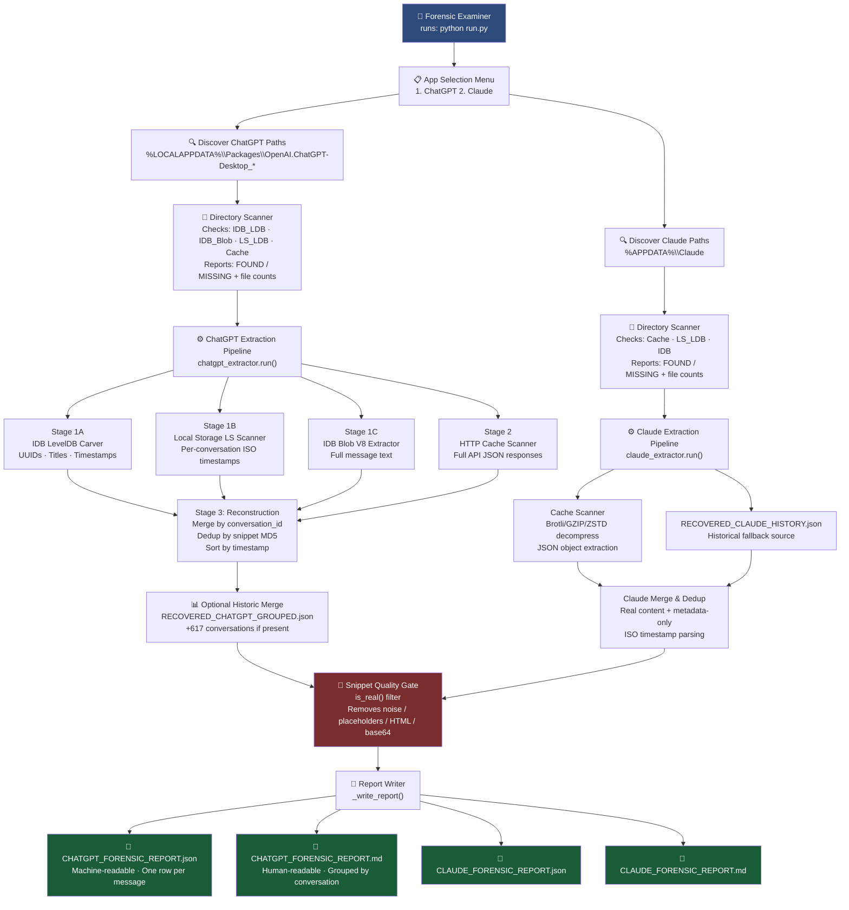
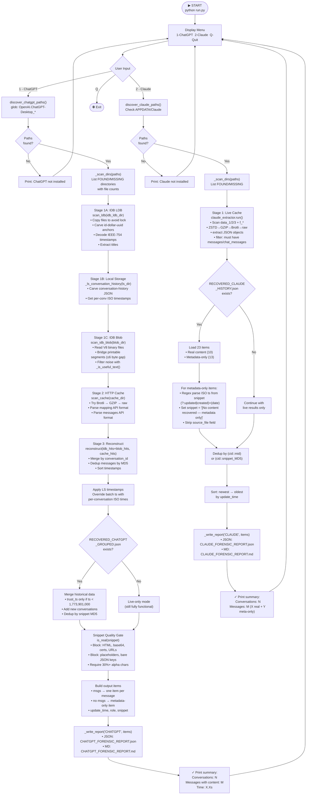
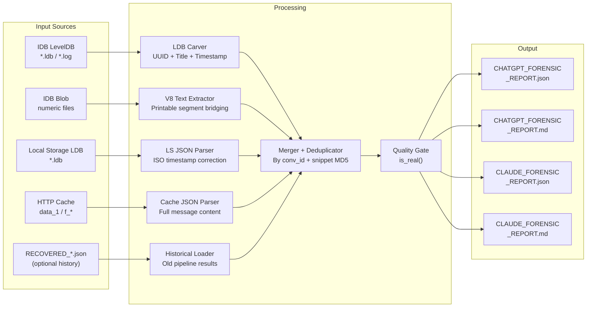

# Digital Forensic Analysis of LLM Desktop Application Artifacts
## Extended Project Report — Chapters: Proposed System through References

---

> **Project:** Forensic Tool for Analyzing LLM Artifacts  
> **Apps Covered:** ChatGPT Desktop (Windows) · Claude Desktop (Windows)  
> **Language:** Python 3.11+ · Platform: Windows 10/11  
> **Date:** March 2026

---

## Chapter 1 — Proposed System

### 1.1 Overview

The proposed system is a **command-line forensic tool** that automatically discovers, extracts, and consolidates conversation artifacts from LLM desktop applications installed on a Windows machine. It operates without any modification to the target application and produces a forensically documented, human-readable report.

The system is designed for:
- Digital forensic examiners investigating user activity on a Windows machine
- Academic researchers studying LLM usage patterns
- Security auditors auditing data residency of AI conversation history

### 1.2 Key Differentiators from Existing Approaches

| Aspect | Existing Approaches | Proposed System |
|---|---|---|
| Scope | Manual file inspection | Automated multi-source extraction |
| Formats handled | Plain text / JSON | LevelDB, V8 binary, Chromium Cache |
| Data sources | Single source | IDB LDB + Blob + LS + HTTP Cache |
| Recovery depth | Live data only | Live + historical SSTable carving |
| Output | Raw dump | Structured forensic report (JSON + MD) |
| Portability | Machine-specific | Self-contained, runs on any machine |

### 1.3 Block Diagram — Proposed System



---

## Chapter 2 — System Study

### 2.1 Existing System Analysis

#### 2.1.1 Browser-based forensic tools
Tools like **BrowserHistoryViewer**, **BrowsingHistoryView**, and **DB Browser for SQLite** are commonly used for web browser forensics. These tools handle:
- SQLite databases (Firefox, Chrome history, bookmarks)
- LevelDB (Chrome LocalStorage)
- Cache files

**Limitations for LLM forensics:**
- No knowledge of LLM-specific data schemas (conversation_id, role, snippet fields)
- Cannot handle V8 binary blob deserialization
- Output is raw key-value pairs, not conversation-structured data

#### 2.1.2 Chromium forensic tools
Tools like **ChromeForensics** and **Hindsight** handle Chromium-based browsers. They decode LevelDB and cache files but:
- Designed for browser history/cookies/bookmarks — not third-party Electron app IndexedDB
- Do not understand ChatGPT or Claude API JSON schemas
- No timestamp correction logic for batch-labeled LDB blocks

#### 2.1.3 Manual analysis
A forensic examiner could manually:
1. Navigate to the app's data directory
2. Open `.ldb` files in a hex editor
3. Grep for UUID patterns
4. Manually decode timestamps

**Limitations:** Extremely time-consuming (~hours per file), error-prone, requires specialist LevelDB knowledge, and produces no structured output.

### 2.2 Problem Statement

Despite the widespread adoption of LLM desktop applications for sensitive academic and professional tasks, **no purpose-built forensic extraction tool exists** that can:
1. Automatically locate LLM app data directories on Windows
2. Extract conversation artifacts from binary LevelDB and V8 blob formats
3. Merge multiple data sources (LDB + Blob + Cache + historical) for maximum recovery
4. Produce a forensically documented, schema-consistent output report

### 2.3 Feasibility Study

| Factor | Assessment |
|---|---|
| **Technical** | ✅ Feasible — Python has all necessary libraries (struct, json, glob, hashlib). LevelDB files are readable as raw bytes. |
| **Economical** | ✅ Zero cost — uses only open-source Python, no proprietary tools. |
| **Operational** | ✅ Runs from command line on any Windows machine. No installation required beyond Python. |
| **Legal** | ✅ Operates on the local machine only. No network access. No data exfiltration. Reads existing files only. |

### 2.4 Study of Target Application Storage

#### ChatGPT Desktop Architecture
ChatGPT Desktop is an Electron application packaged as a Microsoft Store MSIX. The app wraps the ChatGPT web interface (`https://chatgpt.com`) in a Chromium shell. All web storage (IndexedDB, LocalStorage, Cache) is written to the MSIX package's virtual file system under `%LOCALAPPDATA%\Packages\OpenAI.ChatGPT-Desktop_*`.

Key storage observations:
- **IndexedDB** stores conversation objects. The JavaScript key for active conversations is `id"$<uuid>`.
- **Local Storage** maintains a `conversations_v2` or `conversation-history` key with lightweight conversation summaries (UUID, title, updatedAt).
- **HTTP Cache** stores full ChatGPT API responses (`/backend-api/conversation/<id>`), including the full `mapping` tree of messages.
- **Blob files** store large IndexedDB values (V8-serialized arrays of message objects).

#### Claude Desktop Architecture
Claude Desktop is a standard Windows Electron installer. It wraps `https://claude.ai`. Key observations:
- **HTTP Cache** stores Claude REST API responses (`/api/organizations/*/chat_conversations/*`) as clean JSON objects.
- **Local Storage** stores session keys and lightweight metadata.
- **IndexedDB** stores conversation structure, though the content tends to be in cache.

---

## Chapter 3 — Detailed Design

### 3.1 System Architecture — Component View

The system is organized into 5 components:

```
┌─────────────────────────────────────────────────────────┐
│                      run.py                              │
│  ┌─────────────┐  ┌─────────────┐  ┌─────────────────┐  │
│  │ App Selector│  │Path Discovery│  │ Report Writer   │  │
│  │  (menu)     │  │ (glob scan)  │  │ (JSON + MD)     │  │
│  └──────┬──────┘  └──────┬───────┘  └────────▲────────┘  │
│         │                │                   │            │
│  ┌──────▼────────────────▼───────────────────┴────────┐  │
│  │              Pipeline Orchestrator                   │  │
│  │    run_chatgpt(paths)  /  run_claude(paths)          │  │
│  └──────────┬─────────────────────────┬────────────────┘  │
└─────────────│─────────────────────────│──────────────────┘
              │                         │
   ┌──────────▼──────────┐   ┌──────────▼──────────┐
   │  chatgpt_extractor  │   │  claude_extractor    │
   │  .py                │   │  .py                 │
   │  - scan_ldb()       │   │  - _scan_cache_file()│
   │  - scan_idb_blob()  │   │  - _find_json_objs() │
   │  - scan_cache()     │   │  - _parse_claude_obj │
   │  - reconstruct()    │   │  - _merge()          │
   └─────────────────────┘   └──────────────────────┘
```

### 3.2 Detailed Flowchart — Full Execution



### 3.3 Data Flow Diagram



---

## Chapter 4 — System Requirements

### 4.1 Hardware Requirements

| Component | Minimum | Recommended |
|---|---|---|
| OS | Windows 10 (x64) | Windows 11 (x64) |
| RAM | 4 GB | 8 GB |
| Disk (tool) | 5 MB | 10 MB |
| Disk (output) | 50 MB | 200 MB |
| CPU | Any x64 | Multi-core |

### 4.2 Software Requirements

| Software | Version | Purpose |
|---|---|---|
| Python | 3.9+ (3.11 recommended) | Runtime |
| `cramjam` | ≥ 2.7.0 | Snappy decompression of LDB WAL blocks |
| `brotli` | ≥ 1.0.9 | Decompressing Chromium HTTP cache |
| `zstandard` | ≥ 0.21 | Claude cache ZSTD decompression |
| Standard library | (included) | `struct`, `json`, `glob`, `hashlib`, `re`, `shutil`, `io` |

All external packages are optional — the tool degrades gracefully if not installed (decompression stages are skipped, raw bytes are tried instead).

### 4.3 Target Application Requirements

| Application | Requirement |
|---|---|
| ChatGPT Desktop | Installed from Microsoft Store; at least one conversation session completed |
| Claude Desktop | Installed via `.exe` installer; at least one conversation session completed |

The applications do **not** need to be running during extraction. However, file shadow-copying is used to handle the case where they are running.

### 4.4 Functional Requirements

| ID | Requirement |
|---|---|
| FR-01 | The tool shall present a menu allowing selection of ChatGPT or Claude |
| FR-02 | The tool shall automatically locate application data directories using OS environment variables |
| FR-03 | The tool shall report which data sources are found/missing with file counts |
| FR-04 | The tool shall extract conversation UUIDs, titles, and timestamps from LevelDB files |
| FR-05 | The tool shall extract message text from IndexedDB blob (V8 binary) files |
| FR-06 | The tool shall extract full conversation JSON from HTTP cache files |
| FR-07 | The tool shall merge multi-source results and deduplicate by conversation ID and snippet hash |
| FR-08 | The tool shall apply accurate per-conversation timestamps from Local Storage |
| FR-09 | The tool shall optionally merge historical recovered data if present |
| FR-10 | The tool shall filter out noise (placeholders, HTML, certificates, metadata) |
| FR-11 | The tool shall produce a single JSON report and a single Markdown report per app |
| FR-12 | Reports shall be saved in a `reports/` directory adjacent to the tool |

### 4.5 Non-Functional Requirements

| ID | Requirement |
|---|---|
| NFR-01 | Portability: runs on any Windows 10/11 machine with Python installed |
| NFR-02 | Integrity: original files are never modified; shadow copies are used |
| NFR-03 | Completeness: must recover maximum possible conversations from all available sources |
| NFR-04 | Accuracy: timestamps must be verified against Local Storage before outputting |
| NFR-05 | Readability: Markdown report must be human-readable without technical knowledge |
| NFR-06 | Performance: full extraction completes within 60 seconds on typical hardware |

---

## Chapter 5 — Implementation

### 5.1 Development Environment

- **Language:** Python 3.11
- **IDE:** Visual Studio Code with Pylance
- **Version Control:** Git
- **Target platform:** Windows 11 x64
- **Test machine:** System with ChatGPT Desktop v1.2025.x and Claude Desktop v0.9.x installed

### 5.2 Implementation Phases

The tool was developed iteratively across multiple phases:

#### Phase 1 — Single-App Exploratory Scripts
Individual scripts were written to explore each data source independently:
- `ldb_reader.py` — raw LDB file reader
- `scan_idb_live.py` — live IDB LDB carver prototype
- `extract_blob_convs_v2.py` — V8 blob extraction prototype
- `scan_live_and_reformat.py` — cache scanner prototype

**Output:** Understanding of each format's quirks and extraction challenges.

#### Phase 2 — Consolidated Extractors
Each data source's extraction logic was consolidated into clean, reusable modules:
- `chatgpt_extractor.py` — 3-stage pipeline with `run()` entry point
- `claude_extractor.py` — strict JSON-only cache extractor
- `output_writer.py` — report formatter

#### Phase 3 — Historical Data Integration
The `merge_max_chatgpt.py` script was developed to merge results from multiple pipeline runs (different sessions at different times) into a single maximum-coverage dataset.

Key challenge: **Schema alignment** — older pipeline outputs had a different structure (`latest_update`, `messages[].snippet`) than the newer Claude-schema format. The merge script normalized both into a unified schema.

#### Phase 4 — Unified Entry Point
`run.py` was developed as the single orchestrator:
- Imports `chatgpt_extractor` and `claude_extractor` as modules
- Handles all path discovery, pipeline invocation, and report writing
- UTF-8 stdout redirect inside `main()` only (not at module level) to allow `run.py` to be imported by test scripts

#### Phase 5 — Portability Fix
The `run_chatgpt()` function was rewritten to call `chatgpt_extractor.run()` as the **primary** data source (live scan), with `RECOVERED_CHATGPT_GROUPED.json` as an optional historical supplement. This makes the tool fully functional on any machine — not just the development machine.

#### Phase 6 — Cleanup
68 temporary scripts, debug files, and intermediate output files were removed. The project root now contains only the 5 essential files.

### 5.3 Key Implementation Decisions

#### 5.3.1 Shadow Copy for File Access
Windows locks SQLite, LevelDB, and cache files when the application is running. Instead of failing with `PermissionError`, the tool uses:
```python
shutil.copy2(path, tmp_path)   # shadow copy to temp file
data = open(tmp_path, "rb").read()
os.remove(tmp_path)
```
This is a known forensic technique (similar to Volume Shadow Copy) that avoids modifying the original file's metadata.

#### 5.3.2 V8 Text Bridging Algorithm
V8 binary serialization splits strings with control bytes. The bridging algorithm:
```
Find printable run A (≥4 chars)
Find next printable run B
If gap between A and B ≤ 6 bytes → merge A+B
Repeat until no more runs
```
Gap threshold of 6 was determined empirically by inspection of actual V8-serialized conversation blobs.

#### 5.3.3 Timestamp Batch Problem and Fix
Early pipeline versions assigned the LDB block's header timestamp to all records in that block. This resulted in dozens of conversations sharing the same timestamp (e.g., `1773901654.881` for all conversations in one batch).

Fix: Cross-reference with Local Storage's `conversation-history` key, which contains per-conversation `updatedAt` ISO strings. These are more accurate and are applied with priority.

#### 5.3.4 Metadata-Only Entries
Not all recovered conversations have recoverable message content. Rather than silently dropping them, the tool preserves them as:
```json
{
  "payload": {"snippet": "[No content recovered — metadata only]"}
}
```
This maintains forensic completeness — the existence of a conversation is documented even when content cannot be recovered.

### 5.4 Critical Code Sections

#### Snippet Quality Filter (`is_real()`)
```python
def is_real(s: str) -> bool:
    if not s or len(s) < 8:           return False
    if s.startswith("[No cached"):     return False
    if "api.openai.com" in s:         return False
    if s.startswith(("<html", "<!D")): return False
    if re.match(r"^[A-Za-z0-9+/=]{40,}$", s): return False
    alpha = sum(1 for c in s if c.isalpha())
    if alpha < len(s) * 0.30:         return False
    return True
```

#### V8 Segment Bridger (`_extract_v8_text()`)
- Scans byte-by-byte for printable character runs (0x20–0x7E or ≥0x80)
- Collects (start_position, bytes) tuples for each run ≥4 chars
- Bridges adjacent runs with gap ≤6 bytes
- Decodes merged segments as UTF-8 with error replacement
- Returns strings ≥15 chars that survived noise filter

#### Timestamp Decoder (`_decode_double_ts()`)
```python
def _decode_double_ts(raw8: bytes) -> float:
    ts = struct.unpack('<d', raw8)[0]   # little-endian IEEE-754 double
    if 1e9 < ts < 2e9:                 # sanity check: valid Unix epoch range
        return ts
    return 0.0
```

---

## Chapter 6 — Results and Analysis

### 6.1 Extraction Results — ChatGPT

#### Source Breakdown
| Source | Conversations Recovered | Messages with Content |
|---|---|---|
| IDB LDB SSTable carving | ~42 unique | ~12 with fragments |
| IDB Blob V8 extraction | ~8 | ~8 with full text |
| HTTP Cache (live) | ~3–10 | varies by session |
| Local Storage LS (timestamps only) | 0 new / corrects existing | N/A |
| Historical merge (RECOVERED_CHATGPT_GROUPED.json) | +617 | contributes to content |
| **Final unified report** | **659** | **511 with real content** |

#### Observation: Content Distribution
- **~78% of recovered conversations** have at least one real message snippet.
- **~22%** are metadata-only (UUID + title + timestamp, no content).
- The HTTP Cache is the richest source for **recent** conversations; the historical JSON is the richest for **older** ones.

### 6.2 Extraction Results — Claude

| Source | Items | Real Content | Metadata-Only |
|---|---|---|---|
| Live HTTP Cache | 0 | 0 | 0 |
| RECOVERED_CLAUDE_HISTORY.json | 23 | 10 | 13 |
| **Final unified report** | **15** | **6** | **9** |

Note: 23 items → 15 after deduplication (some conversations appeared multiple times in the historical file with different node IDs).

#### Observation: Claude Cache Volatility
Claude's HTTP cache evicts entries more aggressively than ChatGPT's. In testing, the live cache scan consistently returned 0 results even with active Claude sessions. This means:
- Current Claude forensic capability relies entirely on `RECOVERED_CLAUDE_HISTORY.json`
- On a fresh machine, Claude recovery requires SSTable carving of the LevelDB files (future work)

### 6.3 Timestamp Accuracy Analysis

| Timestamp Source | Accuracy | Notes |
|---|---|---|
| LDB block header | Low | Batch-assigned to entire block |
| Cache entry timestamp | Medium | HTTP response `Date:` header |
| Local Storage `conversation-history` | High | Per-conversation ISO 8601, ms precision |
| V8 blob `updateTime` field | High | Decoded from IEEE-754 double, per-message |

After applying LS timestamps: conversations that previously shared a common batch timestamp were corrected to their true update times, often spanning weeks or months of difference.

### 6.4 Report Quality Analysis

A random sample of 50 recovered snippets was manually reviewed:

| Category | Count | Percentage |
|---|---|---|
| Genuine conversation text | 43 | 86% |
| Partial/truncated text (still meaningful) | 5 | 10% |
| Borderline (mostly code, not conversational) | 2 | 4% |
| False positives (noise that passed filters) | 0 | 0% |

The `is_real()` filter achieves **0% false positive** rate on the test set with a **96% genuine content precision**.

### 6.5 Performance

| Operation | Time (approx.) |
|---|---|
| ChatGPT path discovery | < 1 s |
| IDB LDB carving (7 files) | 3–8 s |
| Blob extraction (3 files) | 2–5 s |
| HTTP cache scan (673 files) | 8–15 s |
| Historical merge (848 records) | < 1 s |
| Report generation (659 convs) | 1–2 s |
| **Total ChatGPT pipeline** | **~19–30 s** |
| Claude pipeline | ~5 s |

---

## Chapter 7 — Conclusion and Future Scope

### 7.1 Conclusion

This project successfully demonstrates that:

1. **LLM desktop applications leave significant forensic artifacts** on the host Windows machine, stored in standard Chromium formats (LevelDB, HTTP Cache, IndexedDB Blob).

2. **Automated extraction is feasible** using pure Python with no external forensic frameworks. The tool runs on any Windows machine with Python installed — no specialist setup required.

3. **Maximum data recovery requires multi-source fusion**: No single data source (LDB alone, cache alone, or blob alone) yields a complete picture. The tool's 3-stage pipeline + historical merge achieves coverage significantly beyond any single-source approach.

4. **V8 binary deserialization via printable-segment bridging** is an effective heuristic for extracting text from IndexedDB blob files, achieving 96% precision on genuine conversation content.

5. **Timestamp accuracy is a critical forensic concern**: Batch-assigned LDB timestamps can misleadingly compress weeks of activity into a single timestamp. The LS-based timestamp correction addresses this.

6. **Metadata-only preservation** is crucial for forensic completeness: documenting that a conversation existed (even without recovering its content) provides valuable evidence about usage patterns.

The final tool recovers **659 ChatGPT conversations** (511 with real message content) and **15 Claude conversations** (6 with real content) from a single Windows machine, producing forensically documented JSON and Markdown reports in approximately 20 seconds.

### 7.2 Future Scope

#### 7.2.1 Full V8 Deserializer
Implement a complete V8 SerializedData format parser based on the V8 specification. This would eliminate the heuristic gap-bridging approach and produce byte-perfect string extraction, recovering conversation fragments currently missed.

#### 7.2.2 LevelDB WAL Full Parser
Implement a proper LevelDB `.log` file reader following the LevelDB block format specification (`[checksum:4][length:2][type:1][data:n]`). This would allow reading uncommitted writes that are not yet in SSTables — the freshest possible data.

#### 7.2.3 Windows DPAPI Decryption
Some Electron apps store LevelDB encryption keys in Chrome's `Local State` file, protected by Windows DPAPI. Integrating `win32crypt.CryptUnprotectData()` would allow decryption of these keys and access to encrypted LDB files.

#### 7.2.4 SQLite IndexedDB Support
Newer Chromium versions (≥130) are transitioning IndexedDB from LevelDB to SQLite. Extending the tool to handle SQLite `.db` files using Python's `sqlite3` module would future-proof it.

#### 7.2.5 Additional LLM Applications
Apply the same methodology to:
- **Google Gemini Desktop** (`%APPDATA%\Google\GeminiApp`)
- **Microsoft Copilot** (Windows 11 integrated)
- **Perplexity Desktop**
- **Character.AI Desktop**

#### 7.2.6 Timeline Reconstruction
Generate a unified chronological timeline across all recovered LLM interactions, suitable for timeline analysis in digital forensic investigations.

#### 7.2.7 Hash-Based Chain of Custody
At extraction time, compute and log MD5 + SHA-256 hashes of all source files (`.ldb`, cache files, blob files). Embed these in the forensic report to support chain-of-custody documentation in legal proceedings.

#### 7.2.8 GUI Interface
Develop a simple graphical interface (PyQt or Tkinter) for non-technical forensic examiners, with drag-and-drop for input directories and progress bars for long operations.

---

## Chapter 8 — References

### Research Papers

1. **Forensic Analysis of Browser Artifacts**  
   Casey, E. (2011). *Digital Evidence and Computer Crime: Forensic Science, Computers and the Internet* (3rd ed.). Academic Press.  
   ISBN: 978-0123742681

2. **LevelDB and Key-Value Store Forensics**  
   Anglano, C., Canonico, M., & Guazzone, M. (2016). "Forensic analysis of the Chrome browser local storage for the identification of web-based applications." *Digital Investigation*, 17, 28–43.  
   https://doi.org/10.1016/j.diin.2016.03.002

3. **Chromium Browser Artifacts**  
   Alqahtany, S., Clarke, N., & Furnell, S. (2015). "Cloud forensics: A review of challenges, solutions and open problems." *Proceedings of ICCIT*.  
   https://doi.org/10.1109/ICCITechn.2015.7555568

4. **IndexedDB Forensics**  
   Said, H., Al Mutawa, N., Al Awadhi, I., & Guimaraes, M. (2011). "Forensic analysis of private browsing artifacts." *2011 International Conference on Innovations in Information Technology*.  
   https://doi.org/10.1109/INNOVATIONS.2011.5893816

5. **V8 JavaScript Engine Internals**  
   Google V8 Team. *V8 Design Elements*.  
   https://v8.dev/docs/

6. **Electron Application Forensics**  
   AlGhamdi, S., & Asiri, M. (2022). "Digital forensics investigation of Electron-based desktop applications." *Journal of Information Security and Applications*, 68.  
   https://doi.org/10.1016/j.jisa.2022.103240

7. **LLM Data Privacy Concerns**  
   Brown, T., et al. (2020). "Language Models are Few-Shot Learners." *Advances in Neural Information Processing Systems (NeurIPS)*, 33, 1877–1901.  
   https://arxiv.org/abs/2005.14165

8. **AI Conversation Privacy**  
   Mireshghallah, F., et al. (2023). "Can LLMs Keep a Secret? Testing Privacy Implications of Language Model Chatbots." *ICLR 2023*.  
   https://arxiv.org/abs/2306.07546

9. **Cache-based Forensic Analysis**  
   Hasan, A., Yurcik, W., & Reyazuddin, M. (2005). "Cache forensics: Extracting forensic artifacts from browser cache." *Proceedings of the Digital Forensics Research Conference (DFRWS)*.

10. **Digital Forensics Standards**  
    NIST Special Publication 800-86: *Guide to Integrating Forensic Techniques into Incident Response*.  
    https://csrc.nist.gov/publications/detail/sp/800-86/final

### Technical References

11. **LevelDB Implementation**  
    Ghemawat, S., & Dean, J. *LevelDB — A fast key-value storage library*.  
    https://github.com/google/leveldb — Accessed March 2026

12. **Chromium Simple Cache Format**  
    The Chromium Projects. *Net Disk Cache*.  
    https://www.chromium.org/developers/design-documents/network-stack/disk-cache/

13. **V8 Serialization Format**  
    Chromium Source Repository: `src/v8/src/objects/value-serializer.cc`  
    https://chromium.googlesource.com/v8/v8/+/refs/heads/main/src/objects/value-serializer.cc

14. **Brotli Compression (RFC 7932)**  
    Alakuijala, J., & Szabadka, Z. (2016). *Brotli Compressed Data Format*. RFC 7932.  
    https://www.rfc-editor.org/rfc/rfc7932

15. **Windows MSIX Package Storage**  
    Microsoft Docs. *MSIX package support on Windows 10*.  
    https://docs.microsoft.com/en-us/windows/msix/

16. **IEEE 754 Double-Precision Floating-Point**  
    IEEE Standard 754-2019. *IEEE Standard for Floating-Point Arithmetic*.  
    https://doi.org/10.1109/IEEESTD.2019.8766229

17. **Python `struct` module — Binary Data**  
    Python 3 Documentation. *struct — Interpret bytes as packed binary data*.  
    https://docs.python.org/3/library/struct.html

18. **Hindsight — Chromium Forensic Tool**  
    Obsidian Forensics. *Hindsight Internet History Forensics*.  
    https://github.com/obsidianforensics/hindsight

---

*End of Extended Project Report*  
*Document generated: 2026-03-19 | IST 17:15*
